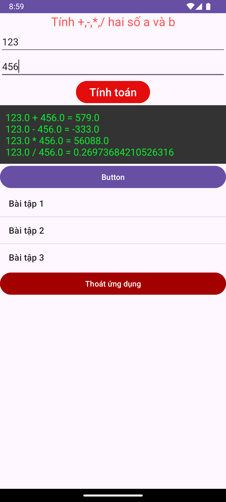

# App2 - Ứng Dụng Máy Tính Cơ Bản

## 📱 Mô tả

App2 là một ứng dụng Android đơn giản thực hiện các phép tính cơ bản (cộng, trừ, nhân, chia) với giao diện thân thiện và tính năng quản lý danh sách bài tập.

## ✨ Tính năng chính

- **Tính toán cơ bản**: Thực hiện phép cộng, trừ, nhân, chia
- **Xử lý lỗi thông minh**: Kiểm tra chia cho 0 và giá trị không hợp lệ
- **Giao diện trực quan**: Hiển thị kết quả với màu sắc phân biệt
- **Danh sách bài tập**: Quản lý các bài tập khác nhau
- **Thoát ứng dụng**: Dialog xác nhận khi thoát

## 🛠️ Công nghệ sử dụng

- **Ngôn ngữ**: Java
- **Framework**: Android SDK
- **UI Components**:
  - EditText (nhập số)
  - TextView (hiển thị kết quả)
  - Button (thực hiện tính toán)
  - ListView (danh sách bài tập)
  - AlertDialog (xác nhận thoát)

## 📱 Giao diện

- Nhập hai số A và B
- Nút "Tính toán" để thực hiện phép tính
- Hiển thị kết quả 4 phép tính cơ bản
- Danh sách bài tập (Bài tập 1, 2, 3)
- Nút thoát với dialog xác nhận

## 🚀 Cách sử dụng

1. Mở ứng dụng
2. Nhập số vào ô "Số A" và "Số B"
3. Nhấn nút "Tính toán"
4. Xem kết quả hiển thị màu xanh (hợp lệ) hoặc vàng (lỗi)
5. Chọn bài tập từ danh sách nếu cần
6. Nhấn "Thoát" để đóng ứng dụng

## ⚠️ Xử lý lỗi

- Kiểm tra chia cho 0: Hiển thị "Không thể chia cho 0"
- Kiểm tra giá trị không hợp lệ: Thông báo lỗi với màu vàng
- Try-catch để xử lý exception khi parse số

## 📋 Yêu cầu hệ thống

- Android 7.0 (API level 24) trở lên
- Android Studio Flamingo hoặc mới hơn
- Java 8+

## 🔧 Cài đặt và chạy

1. Clone repository này
2. Mở project trong Android Studio
3. Sync Gradle files
4. Chạy ứng dụng trên device hoặc emulator

## 📝 Ghi chú

- Package name: `com.example.bai2`
- Theme: `Theme.Bai2`
- Minimum SDK: 24
- Target SDK: 34

## 👨‍💻 Tác giả

Lưu Lâm Công - Phát triển trong khóa học lập trình Android

---
*Ứng dụng được phát triển cho mục đích học tập và thực hành lập trình Android.*
